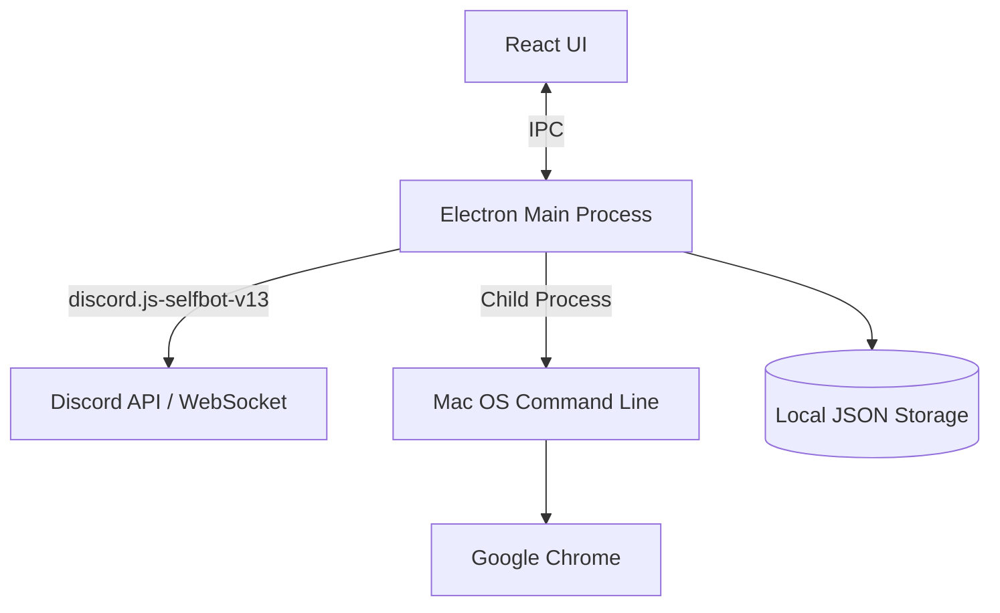

# Thiết kế Hệ thống & Kiến trúc: open-link-discord

## Tổng quan Kiến trúc
**Cấu trúc hệ thống cấp cao là gì?**

Dự án này sẽ được xây dựng như một ứng dụng máy tính để bàn (Desktop App) bằng **Electron** (hoặc Tauri) kết hợp với **React** cho Frontend và Node.js cho Backend/Main Process. Lựa chọn này cho phép hệ thống vừa có giao diện UI để quản lý cài đặt (từ khóa, token, chọn kênh), vừa có quyền thực thi lệnh hệ thống (để mở Google Chrome với cấu hình cụ thể).

- **React UI**: Quản lý giao diện, nhập token, chọn kênh Discord, CRUD từ khóa và danh sách Chrome profiles.
- **Electron Main Process**: 
  - Đóng vai trò là backend cục bộ.
  - Lắng nghe message qua websocket của Discord bằng tài khoản cá nhân (sử dụng `discord.js-selfbot-v13`).
  - Phân tích tin nhắn theo từ khóa.
  - Khi có khớp từ khóa, gọi module mở link (sử dụng Node.js `child_process.exec()`).
- **Local JSON Storage**: Lưu trữ cấu hình nhạy cảm và cài đặt cục bộ (Token, Kênh đã chọn, Từ khóa) bằng `electron-store` hoặc file JSON.

## Mô hình Dữ liệu
**Chúng ta cần quản lý dữ liệu gì?**

Dữ liệu chủ yếu là cấu hình cục bộ của người dùng:

1. **User Settings (`settings.json`)**:
   - `discordToken`: String (Token tài khoản cá nhân).
   - `selectedGuildId`: String (ID Máy chủ/Server).
   - `selectedChannelId`: String (ID Kênh cần lắng nghe).
   - `keywords`: Array of Strings (Danh sách các từ khóa đang theo dõi).
   - `targetProfileId`: String (ID hoặc tên thư mục của Chrome Profile, ví dụ: "Profile 1").

2. **Chrome Profiles Data**:
   - Dữ liệu thu thập tự động từ thư mục `~/Library/Application Support/Google/Chrome/Local State` để map giữa tên thân thiện (vd: "Gin (Bic-6)") và thư mục thực tế (vd: "Profile 8").

## Thiết kế API / IPC
**Các thành phần giao tiếp với nhau như thế nào?**

Do là mô hình Electron, các thành phần giao tiếp qua **Inter-Process Communication (IPC)**.

- `ipcRenderer.invoke('get-settings')` -> `Settings Object`
- `ipcRenderer.invoke('save-settings', settings)` -> `boolean`
- `ipcRenderer.invoke('start-listening')` -> Bắt đầu kết nối Discord (self-bot).
- `ipcRenderer.invoke('stop-listening')` -> Ngắt kết nối.
- `ipcRenderer.invoke('get-chrome-profiles')` -> Trả về danh sách profiles phân tích được từ hệ điều hành.
- Main Process có thể gửi event `ipcMain.emit('discord-status', status)` để cập nhật trạng thái UI (Đang kết nối, Đã kết nối, Lỗi token, v.v.).

## Phân rã Thành phần
**Các khối xây dựng chính là gì?**

1. **Service Quản lý Discord**:
   - Khởi tạo client `discord.js-selfbot-v13`.
   - Lắng nghe sự kiện `messageCreate`.
   - Phân tích nội dung tin nhắn, tìm `http(s)://...`.
   - Kiểm tra xem tin nhắn có chứa bất kỳ từ khóa nào trong danh sách `keywords` hay không.
2. **Service Điều khiển Hệ điều hành (OS Execution)**:
   - Module thực thi shell script mở trình duyệt với arguments.
   - Hàm tiện ích đọc file `Local State` của Chrome để parse danh sách profiles.
3. **UI Components (React)**:
   - **Dashboard**: Hiển thị trạng thái kết nối Discord và log các link đã mở gần đây.
   - **Settings > Discord**: Nhập Token, dropdown chọn Server, dropdown chọn Channel (load động từ API sau khi token hợp lệ).
   - **Settings > Keywords**: Giao diện tag-input hoặc list để Thêm/Xóa/Bật/Tắt từ khóa.
   - **Settings > Chrome**: Dropdown chọn Chrome profile đích.

## Quyết định Thiết kế
**Tại sao chúng ta chọn phương pháp này?**

- **Electron**: Lựa chọn dễ dàng nhất cho nhà phát triển web để xây dựng desktop app kiểm soát được hệ thống cục bộ (mở ứng dụng theo profile trên Mac OS không thể làm được qua web thông thường do bảo mật của trình duyệt).
- **discord.js-selfbot-v13**: Mặc dù vi phạm TOS, nó là thư viện tốt nhất hiện tại hỗ trợ kết nối bằng user token để lắng nghe channel như con người, đáp ứng đúng yêu cầu của người dùng.
- **Phân tích thủ công JSON của Google Chrome**: Chrome lưu trữ tên profile ("Gin (Bic-6)") và thư mục thật ("Profile x") trong file `Local State`. Việc tự phân tích file này đem lại trải nghiệm UI tốt nhất thay vì bắt người dùng tự đoán "Profile x" của họ là ai.

## Yêu cầu Phi chức năng
**Hệ thống cần hoạt động như thế nào?**

- **Hiệu suất / Độ trễ**: Phản hồi phải gần như tức thời. Ngay khi tin nhắn xuất hiện trên discord, link phải được mở lên chưa tới 1 giây. `child_process` của Node.js là đủ nhanh.
- **Bảo mật**: Token Discord của cá nhân rất nhạy cảm. Nó KHÔNG ĐƯỢC gửi lên bất cứ máy chủ bên thứ 3 nào, chỉ được lưu cục bộ trên máy người dùng.
- **Khả năng vận hành**: Có cơ chế tự động kết nối lại (auto-reconnect) nếu mạng rớt, đảm bảo không bỏ lỡ thông báo khẩn cấp.
